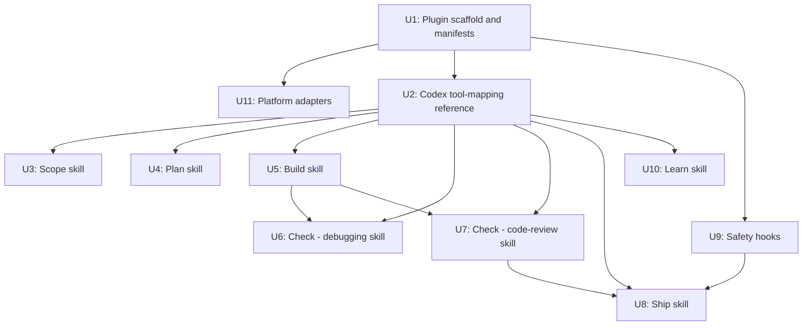
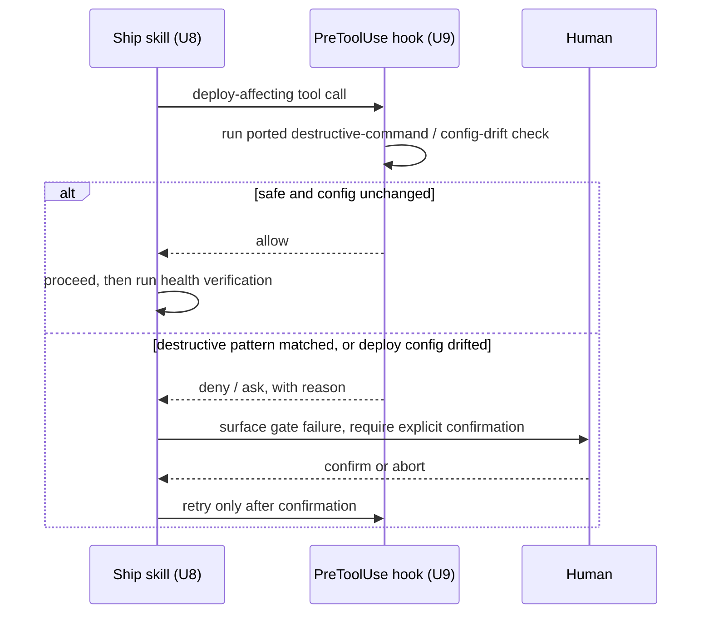

# Unify Compound Engineering, gstack, and pstack into one plugin

## Summary

Fork Compound Engineering as the plugin's spine, port pstack's and gstack's mined techniques into its own skill and hook conventions, and ship six phase skills (Scope, Plan, Build, Check, Ship, Learn) as one native Claude Code + Codex plugin — each phase paired with a thin slash-command wrapper, routing driven entirely by skill `description` frontmatter, no custom hook-based router, and no live install of either mined source.

## Problem Frame

The origin brainstorm assumed gstack was installable alongside Compound Engineering and pstack the same way those two are. Planning-time research found otherwise: gstack has no `.claude-plugin/plugin.json` at all — it installs as a raw Skills bundle that directly mutates the user's global `~/.claude/settings.json` to register hooks and self-updates via its own SessionStart hook. Separately, Compound Engineering's own `docs/solutions/` revealed its 32 skills run entirely hook-free, routed by `description` frontmatter alone. Both facts reshape how the six phase commands and the mined techniques actually get built; this plan translates the confirmed brainstorm scope into implementation units grounded in the three sources' real file conventions rather than the brainstorm's earlier assumptions.

## Requirements

**Packaging & command surface**
- R1. Ships as a single native plugin covering every platform Compound Engineering supports — Claude Code, Codex, Cursor, Devin, Kimi, Grok, and Antigravity via static manifests resolving to one shared `skills/` directory (no build step), plus OpenCode via a generated-command shim and Cline via an install-time symlink script (both following Compound Engineering's own adapter code as the template). Revised from the original Claude Code + Codex-only scope once pstack's platform limit stopped being a live-install constraint — see Key Technical Decisions.
- R2. Six unified phase commands (Scope, Plan, Build, Check, Ship, Learn) are the primary interface. Each is a thin slash-command wrapper (`disable-model-invocation: true`) around one or more corresponding skills whose own `description` drives model auto-invocation — Check is the one command that wraps two skills (see R8), routed explicitly by the command itself rather than by model auto-invocation.
- R3. Neither pstack nor gstack is installed as a live plugin or skill bundle. Both are mined for technique only; their SessionStart hooks and self-update/settings-mutation mechanisms are not carried forward.
- R4. The plugin is a one-time fork of all three source projects' current state, with no live sync mechanism against any of them.

**Phase: Scope & Sign-off**
- R5. Before planning starts, the Scope skill runs product framing, architecture lock-in, and design/DX sign-off, mined from gstack's office-hours, plan-ceo-review, plan-eng-review, plan-design-review, and plan-devex-review content.

**Phase: Plan**
- R6. The Plan skill is Compound Engineering's `ce-plan` content, with pstack's type/module-shape-first discipline folded in as an explicit step before implementation-unit definition.

**Phase: Build**
- R7. The Build skill is Compound Engineering's `ce-work` content, gaining pstack's reproduce-before-fix discipline, a prove-it-works verification gate, and reversibility-based autonomy.

**Phase: Check**
- R8. Two Check-phase skills: a debugging skill (Compound Engineering's `ce-debug` + pstack's `tdd`, with gstack's `investigate` reviewed for additive content) and a code-review skill (tiered persona review as the default, a blast-radius execution-proof safety pass, two parallel escalation paths — pstack's `interrogate` and gstack's `/codex` — a deepest thermo-nuclear tier, and built-in comment hygiene).

**Phase: Ship**
- R9. The Ship skill runs gstack's QA/release content through production deploy and health verification, with pstack's `babysit` persistence folded in, gated behind the safety hooks in R10.

**Safety**
- R10. Destructive-command and production-deploy gating, equivalent to gstack's `/careful` and `/freeze` (gstack's `/guard` is those two composed, not a distinct third check), is implemented as standard plugin-scoped hooks (`hooks/hooks.json`), porting gstack's check logic rather than its global-settings-mutation mechanism. Coverage of this gate for tool calls issued by dispatched subagents (not just the top-level session) needs verifying before U9 is authored — see Risks & Dependencies.

**Phase: Learn**
- R11. The Learn skill writes to `docs/solutions/`/`CONCEPTS.md` (Compound Engineering's pattern) and includes a `reflect`-style decision step for whether a learning warrants a skill-level edit. Codebase indexing (a GBrain equivalent) is not part of this plan.

---

## Key Technical Decisions

- **Routing via skill `description` frontmatter, not a hook-based router.** Compound Engineering achieves this across 32 skills with zero hooks; reusing the pattern gives R2's six commands a proven, portable dispatch mechanism instead of a new custom router.
- **Six phase commands as thin wrappers, per pstack's `commands/*.md` convention.** `disable-model-invocation: true` plus "invoke the `<name>` skill" gives an explicit slash command and model-auto-invocation from one source without double-triggering.
- **One centralized Claude→Codex tool-name mapping file**, extending pstack's `codex-tools.md` pattern, shared by all six phase skills — avoids Compound Engineering's per-skill duplicated inline mapping lists.
- **Cross-lineage specialist dispatch uses generic subagents seeded with prompt-fragment files** (Compound Engineering's `references/personas/` pattern), not named custom agent types. gstack's independently-built review-army pattern converges on the same approach; it also doesn't depend on a platform's custom-subagent-type feature, which portability across Claude Code and Codex favors. This applies to U7's parallel specialist audit specifically — U3's four sign-off dimensions (product, architecture, design, DX) run as sequential staged sections within one skill instead, because sign-off is cumulative (each stage's output frames the next) where U7's specialists audit independent, parallelizable concerns.
- **Safety-check hooks are plugin-scoped `PreToolUse` entries in `hooks/hooks.json` (pstack's mechanism), not gstack's global-settings-mutation approach.** Plugin-scoped `PreToolUse` hooks have the same blocking power gstack's mechanism does — both can return a `deny`/`ask` decision before the tool call executes; gstack's heavier mechanism (direct `~/.claude/settings.json` mutation, atomic locking, ownership table) solves a different problem, self-updating and surviving across many gstack-authored hooks it manages centrally, which this plugin doesn't need since it ships a fixed, small hook set declared once at install time. Two behaviors ported from gstack's actual hook scripts are load-bearing and must carry over exactly: the decision **must nest under `hookSpecificOutput`** (a top-level `permissionDecision` is silently ignored by Claude Code); and fail-safe direction is tier-dependent — an ask-tier hook fails toward "ask" on unparseable input, a deny-tier hook fails toward "deny," never the reverse, since "a boundary that fails open is not a boundary."
- **`/codex` and `interrogate` stay as two separate escalation paths** in the code-review skill rather than merging into one — they work through different mechanisms (external CLI shell-out vs. in-process multi-model subagent dispatch) despite similar intent, refining the origin brainstorm's "same idea" framing.
- **The Check phase ships as one `commands/check.md` wrapper that argument-routes to the debugging and code-review skills**, preserving R2's six-command surface rather than splitting into a seventh command. The two skills underneath (U6, U7) stay separate because debugging and code review are different jobs; only the command surface unifies.
- **GBrain-equivalent codebase indexing is out of scope**, since the mined gstack pieces cover specific technique files, not its indexing engine — substantial standalone infrastructure on its own that nothing in this plan's research touched.
- **gstack's `/spec` is not separately mined.** Its job — converting a vague ask into a precise, executable spec — is already covered by `ce-plan`'s own Planning Bootstrap phase, which the Plan skill inherits directly.
- **Working plugin name: `cep`**, inferred from this workspace's own directory name (`cep-workflow`). A placeholder — trivially renamed before publishing, not a load-bearing decision.
- **Platform scope revised to all of Compound Engineering's supported platforms, not just Claude Code + Codex.** The original narrower scope was reasoning inherited from pstack's 2-platform limit, set before pstack was repointed to mined-not-installed — that constraint no longer applies once nothing in this plugin depends on pstack's or gstack's own platform support. Cursor, Devin, Kimi, and Grok get static manifests identical in shape to `.codex-plugin/plugin.json`; Antigravity gets a root-level manifest plus a symlinked `.agy/` directory; OpenCode gets a small JS shim (ported from Compound Engineering's own `.opencode/plugins/compound-engineering.js`) that generates one command per skill from its frontmatter; Cline gets an install-time symlink script (ported from Compound Engineering's own `.cline/scripts/`) rather than a manifest.
- **Safety hooks (U9) do not extend beyond Claude Code and Codex, and cannot.** Confirmed from gstack's own source: `PreToolUse` hooks are a Claude-Code-specific mechanism gstack itself doesn't attempt to port to its other host adapters (its hook implementations live under `hosts/claude/`, separate from every other host). The other seven platforms ship the six skills with no destructive-command or deploy-gating layer — a structural platform limitation, not a scope cut this plan is choosing to leave unaddressed.
- **OpenCode's generated commands don't replicate `commands/check.md`'s routing.** Compound Engineering's shim generates one command per skill file directly from frontmatter — it has no concept of one command wrapping two skills. On OpenCode, `check-debug` and `check-review` surface as two separate commands rather than one routed `/check`; this is a platform-shim limitation inherited from Compound Engineering's own adapter code, not something this plugin's authoring introduced.
- **Cline reads `skills/` directly and has no concept of the `commands/` wrapper layer at all.** Its install script symlinks skill directories by name; none of the six skills in this plugin set `disable-model-invocation` on the skill itself (only the `commands/*.md` wrappers do), so all six activate by description-matching on Cline with no manual slash-command equivalent to `/scope`, `/plan`, etc.

---

## High-Level Technical Design

Implementation-unit dependency graph:

U3-U7 and U10 each pair with a thin `commands/<phase>.md` wrapper (not shown as separate nodes — each wrapper is part of its skill's own unit, not a distinct dependency). Every unit from U3 onward depends directly on U2 for Codex tool-name resolution, not only the four edges that would otherwise look most prominent in the graph.

The `U9 --> U8` edge above is a build-order dependency only. The runtime relationship it stands for — a hook intercepting a deploy-affecting tool call before execution — is the plan's single highest-risk interaction and warrants its own sequence view:

Two distinct trigger conditions land on the same block-then-confirm path: a destructive-command pattern match (ported from gstack's `careful` check) and deploy-config drift since the last confirmation (U8's own dry-run gate). Neither fails silently — both surface to a human before anything retries.

The hook itself matches on tool/command pattern, not on which phase skill is currently running — there's no "Ship phase" concept the hook can scope against. It fires plugin-wide, including during ordinary Build-phase work; that's intentional (the same destructive-command protection should apply everywhere), not a gap in the diagram above.

---

## Implementation Units

### U1. Plugin scaffold and manifests

**Goal:** Establish the merged plugin's root structure using the verified native pattern — no build step for the Claude Code + Codex baseline.
**Requirements:** R1, R3, R4
**Dependencies:** None
**Files:** `.claude-plugin/plugin.json`, `.codex-plugin/plugin.json`, `README.md`, a skill-authoring template/checklist (frontmatter shape, Platform-note boilerplate, command-wrapper shape)
**Approach:** `.claude-plugin/plugin.json` needs no explicit `skills`/`commands` array — Claude Code auto-discovers `skills/` by directory convention, confirmed from both source plugins' manifests. `.codex-plugin/plugin.json` needs the explicit `"skills": "./skills/"` pointer field, matching both source plugins' Codex manifests exactly. README documents the six phase commands and states plainly that pstack and gstack are ported sources, not runtime dependencies. Every skill from U3 onward re-derives the same three pieces of boilerplate (frontmatter shape, the "Platform note" paragraph pointing at U2's mapping file, the command-wrapper shape) — this unit also produces the internal template those units conform to, so the pattern has one canonical source instead of six to seven independently-authored copies that can drift.
**Patterns to follow:** `.claude-plugin/plugin.json` and `.codex-plugin/plugin.json` field shapes from both Compound Engineering's and pstack's installed manifests (name, version, description, author, license, keywords, homepage/repository).
**Test scenarios:**
- Happy path: plugin installs in a clean Claude Code environment and all skills under `skills/` are discoverable without a `commands`/`skills` array in `.claude-plugin/plugin.json`.
- Happy path: plugin installs in Codex via the native `.codex-plugin/plugin.json` path and the same skills are reachable, no converter step invoked.
**Verification:** Fresh install on both platforms surfaces the six phase commands with no manual registration step.

### U2. Centralized Codex tool-mapping reference

**Goal:** One shared source of truth for Claude→Codex tool-name resolution, used by every phase skill instead of duplicating the mapping per skill.
**Requirements:** Supports R2, R6, R7 (any skill naming Claude-specific tools)
**Dependencies:** U1
**Files:** a shared reference file (exact path is an Open Question below)
**Approach:** Extend pstack's `codex-tools.md` content — Read/Edit/Bash/Task/AskUserQuestion/TodoWrite mappings, model-slug mapping, built-in-skill mapping, CLAUDE.md-vs-AGENTS.md resolution — generalized so it isn't scoped under a `poteto-mode`-named skill, since no single skill in the merged plugin plays that role. Each phase skill's "Platform note" paragraph (pstack's existing convention) points here instead of restating the table inline (Compound Engineering's current, more duplicative approach).
**Patterns to follow:** pstack `skills/poteto-mode/references/codex-tools.md`; the "Platform note" paragraph convention from pstack's `architect`/`interrogate` skills.
**Test expectation:** none — this is a reference document, not executable behavior.
**Verification:** Every phase skill's Codex-specific tool reference resolves through this one file; no phase skill inlines its own copy of the mapping table.

### U3. Scope skill

**Goal:** Implement R5 — product framing and specialist sign-off before planning.
**Requirements:** R5
**Dependencies:** U1, U2
**Files:** `skills/scope/SKILL.md`, `commands/scope.md`, `skills/scope/references/` (mined review-question content)
**Approach:** Adapt gstack's office-hours, plan-ceo-review, plan-eng-review, plan-design-review, and plan-devex-review question sets into one skill's staged sections — product framing, architecture lock-in, design review, DX review — run in sequence rather than as five separate commands. Sequential, not parallel-subagent, on purpose: each stage's output frames the next (architecture lock-in reads the product framing's answer, design review reads the locked architecture), so this differs deliberately from U7's parallel specialist dispatch, where the review dimensions are independent. `commands/scope.md` is the thin wrapper (`disable-model-invocation: true`, "invoke the `scope` skill").
**Patterns to follow:** pstack `commands/*.md` thin-wrapper shape (U2's shared reference for any Codex-specific tool names).
**Test scenarios:**
- Happy path: invoking Scope on a vague one-line feature request surfaces sign-off questions across all four review dimensions without inventing implementation detail.
- Edge case: invoking Scope on a request that's already well-specified (clear actors, clear architecture) still runs the pass but doesn't pad it with unnecessary questions.
**Verification:** A sample vague ask produces a sign-off pass touching product, architecture, design, and DX; no phase content leaks Build/Check/Ship-level implementation detail.

### U4. Plan skill

**Goal:** Implement R6 — Compound Engineering's planning process, sharpened with pstack's type-first discipline.
**Requirements:** R6
**Dependencies:** U1, U2
**Files:** `skills/plan/SKILL.md` (adapted from Compound Engineering's `skills/ce-plan/SKILL.md`), `commands/plan.md`
**Approach:** Carry `ce-plan`'s phase structure (source-document use, research, question resolution, Implementation Unit structuring) forward as the base. Add an explicit step, before Implementation Units are drafted, requiring the plan to name the core data/type shapes any unit crossing a function boundary will touch — pstack's `architect` discipline — rather than leaving that to `ce-work`'s discretion.
**Patterns to follow:** Compound Engineering `skills/ce-plan/SKILL.md`; pstack `skills/architect/SKILL.md` for the type-first step's framing.
**Test scenarios:**
- Happy path: planning a feature that touches 2+ components produces Implementation Units with named data shapes, not just file lists.
- Integration: a plan sourced from an upstream Scope-skill output carries that context forward rather than re-asking resolved questions.
**Verification:** A sample plan's Implementation Units each name the shape of any new type before describing behavior.

### U5. Build skill

**Goal:** Implement R7 — Compound Engineering's execution skill, gaining pstack's reproduce-first, prove-it-works, and reversibility disciplines.
**Requirements:** R7
**Dependencies:** U1, U2
**Files:** `skills/build/SKILL.md` (adapted from Compound Engineering's `skills/ce-work/SKILL.md`), `commands/build.md`
**Approach:** Carry `ce-work`'s execution loop forward as the base. Add three explicit gates: (1) bug-shaped work reproduces the failure as a test before any fix, mined from pstack's `tdd`; (2) work isn't declared complete until verified against the real artifact, not a proxy, mined from pstack's `principle-prove-it-works`; (3) reversible work proceeds without asking, irreversible work always pauses, mined from pstack's `principle-never-block-on-the-human`.
**Patterns to follow:** Compound Engineering `skills/ce-work/SKILL.md`; pstack `skills/tdd/SKILL.md` and the two named principle skills for their exact framing (full read still needed — see Open Questions).
**Test scenarios:**
- Happy path: a bug-fix task produces a failing reproduction test before the fix lands.
- Edge case: a reversible refactor with a clear default proceeds without an unnecessary confirmation prompt.
- Error path: an irreversible action (force-push, data deletion) always pauses for confirmation regardless of the reversibility default.
**Verification:** Sample bug-fix and refactor tasks demonstrate reproduce-first and appropriate autonomy respectively; the verification gate rejects a "looks done" claim with no artifact-level proof.

### U6. Check — debugging skill

**Goal:** Implement the debugging half of R8.
**Requirements:** R8
**Dependencies:** U1, U2, U5
**Files:** `skills/check-debug/SKILL.md` (invoked via the shared `commands/check.md` wrapper — see U7)
**Approach:** Merge Compound Engineering's `ce-debug` root-cause investigation structure with pstack's `tdd` reproduce-first discipline into one debugging flow. Read gstack's `investigate/SKILL.md` in full during this unit (not read during planning) and fold in anything additive beyond what the CE+pstack merge already covers.
**Patterns to follow:** Compound Engineering `skills/ce-debug/SKILL.md`; pstack `skills/tdd/SKILL.md`.
**Test scenarios:**
- Happy path: a reported bug with a clear repro produces root-cause analysis plus a failing test before any fix.
- Edge case: a bug with no initial repro steps still reaches a reproduction before the flow proceeds to root-cause analysis.
- Integration: debugging output flows cleanly into the Build skill for the actual fix.
**Verification:** A sample bug report is traced to root cause with a reproduction test, matching the standard both source skills already meet individually.

### U7. Check — code-review skill

**Goal:** Implement the code-review half of R8.
**Requirements:** R8
**Dependencies:** U1, U2, U5
**Files:** `skills/check-review/SKILL.md`, `skills/check-review/references/personas/*.md` (ported specialist prompt fragments), `commands/check.md` (single thin wrapper for both U6 and U7 — see Approach for its routing rule, preserving R2's six-command surface rather than shipping a seventh command for the Check phase)
**Approach:** Default tier is tiered persona review using the generic-subagent-plus-prompt-file dispatch convention (Key Technical Decisions), combining Compound Engineering's persona set with gstack's `review/specialists/` fragments (security, performance, testing, maintainability, data-migration, api-contract, simplification, red-team) where they add coverage CE's set doesn't already have. A blast-radius pass runs before the escalation tiers — proves safety by executing real code rather than reading the diff. Two parallel escalation paths sit above the default tier: pstack's `interrogate` (in-process multi-model subagent dispatch) and gstack's `/codex` (external Codex CLI shell-out), kept distinct per the Key Technical Decision; a high-risk diff triggers both. The `/codex` path sends diff content to an external process — scrub secrets/credentials before shell-out, and on a Codex-hosted install, this tier isn't a meaningful independent opinion (shelling out to Codex from Codex), so it folds into interrogate-only there instead. `thermo-nuclear-code-quality-review`'s content becomes the deepest tier. Comment hygiene (pstack's `no-comments`/`comment-sicko`) runs as a built-in pass within this skill, not a separate command. `commands/check.md` routes on explicit sub-argument (`/check debug` or `/check review`); with no sub-argument, it inspects the task description for bug/error/repro language to pick `check-debug`, defaulting to `check-review` on ambiguous input.
**Patterns to follow:** Compound Engineering's persona-prompt-file dispatch (`references/personas/`); gstack `review/sections/review-army.md` and `review/specialists/*.md` for the specialist-fragment shape; pstack `skills/interrogate/SKILL.md` for the multi-model dispatch table shape.
**Test scenarios:**
- Happy path: a moderate diff gets tiered persona review with comment hygiene applied automatically.
- Edge case: a large or high-risk diff (auth, payments, data mutation) triggers escalation to both the interrogate and `/codex` paths on a Claude Code host.
- Edge case: the same high-risk diff on a Codex-hosted install runs interrogate only, since the `/codex` tier collapses on that host.
- Integration: a change with real blast radius beyond its own diff is caught by the blast-radius pass before either escalation tier runs.
- Edge case: `commands/check.md` invoked with no sub-argument and an ambiguous task description defaults to `check-review` rather than failing or invoking both skills.
**Verification:** A sample high-risk diff produces findings from the default tier, the blast-radius pass, and both escalation paths on Claude Code (interrogate only on Codex), with no duplicate findings across tiers.

### U8. Ship skill

**Goal:** Implement R9 — QA through production deploy, gated behind U9's safety hooks.
**Requirements:** R9
**Dependencies:** U1, U2, U7, U9
**Files:** `skills/ship/SKILL.md`, `commands/ship.md`
**Approach:** Mine gstack's `/qa` and `/ship` content for the get-to-green-and-merged flow. Mine `/land-and-deploy`'s staged rollout logic, including its config-fingerprint dry-run gate (re-validates the deploy config when it's changed since last confirmation), for the production-deploy step — name the specific health-check signal, threshold, and timeout that gate stage-advancement explicitly during authoring; if gstack's signal turns out to be infra-specific and not portable, that becomes a per-adoption configuration point rather than hardcoded logic (see Open Questions). Fold in pstack's `babysit` so the skill stays attached to an open PR — fixing CI failures, handling straightforward comments — rather than running once and stopping. Every deploy-affecting action routes through U9's hooks rather than gstack's own settings-mutation mechanism. A failure before any stage has shipped traffic needs only a stop-and-report; a failure after a stage has shipped traffic requires rollback — rollback fires autonomously with notification for a clear health-check failure, but always pauses for human confirmation when the failure signal is ambiguous, matching U5's reversibility gate. If interrupted mid-rollout (session end, crash), the skill detects and surfaces the in-progress partial state on resume rather than silently restarting or abandoning it.
**Patterns to follow:** gstack `land-and-deploy/SKILL.md` and its `sections/first-run-validation.md` for the dry-run gate shape; pstack `skills/babysit/SKILL.md` for the persistence loop.
**Test scenarios:**
- Happy path: a PR with passing CI and no deploy-config changes ships through to a health-verified production deploy.
- Edge case: a PR fails CI once; the skill fixes it and continues without a second manual invocation.
- Error path: deploy is attempted with a changed deploy config since the last confirmation — the dry-run gate re-validates before proceeding.
- Error path: health check fails after a stage has shipped traffic — the skill halts and rolls back rather than advancing to the next stage.
- Edge case: skill execution is interrupted mid-rollout — on resume, the in-progress partial state is detected and surfaced, not silently restarted or abandoned.
**Verification:** A sample PR run demonstrates unattended CI-fix persistence and a gated deploy that re-confirms on config drift; a simulated mid-rollout health-check failure demonstrates halt-and-rollback rather than silent advancement.

### U9. Safety hooks

**Goal:** Implement R10 — destructive-command and deploy gating as standard plugin-scoped hooks.
**Requirements:** R10
**Dependencies:** U1
**Files:** `hooks/hooks.json`, hook check scripts (ported logic, exact filenames TBD during authoring)
**Approach:** Port the check logic from gstack's `careful/bin/check-careful.sh` (destructive Bash command detection) and `freeze/bin/check-freeze.sh` (directory-scope edit restriction) into `PreToolUse` entries in this plugin's own `hooks/hooks.json`, matching pstack's hook-declaration shape (`hooks/hooks.json` structure, `${CLAUDE_PLUGIN_ROOT}` substitution) rather than gstack's inline-frontmatter-plus-settings-mutation mechanism (see Key Technical Decisions for why the swap is safe). gstack's `/guard` is these two checks composed (three stacked hook entries), not a separate third check to port. This becomes the gate U8's deploy step runs behind. Five behaviors read directly from gstack's actual scripts must carry over, not just the general intent: (1) a two-tier decision model — a small set of catastrophic, syntactically simple commands (no `;`/`&&`/`||`/`|`/newline) hard-deny; broader destructive-command families ask instead, always overridable, since string matching can't safely resolve what a compound command does; (2) the decision object must nest under `hookSpecificOutput` — a top-level `permissionDecision` is silently ignored; (3) fail-safe direction is tier-dependent, ask-tier fails toward "ask," deny-tier (the freeze-equivalent boundary) fails toward "deny," on any unparseable input; (4) freeze-equivalent path resolution must resolve the full canonical path — every component, not only the final one — following any symlink (intermediate or final) to its real target before comparing against the boundary; (5) the deny-tier check needs an explicit bypass for legitimate rollback commands issued by U8 during an active incident — an allowlisted rollback-command shape or a context flag U8 sets when invoking a confirmed rollback — so the safety boundary cannot block the exact recovery action it exists to permit. **Confirmed during planning (resolved, not left open):** Codex's `PreToolUse` hooks support `deny` correctly but silently ignore `ask` — `permissionDecision: "ask"` is accepted but fails open with no prompt (openai/codex#28437, open as of this plan). The two-tier model in behavior (1) above is therefore platform-conditional: on Claude Code, MEDIUM-tier commands ask as designed; on Codex, MEDIUM-tier commands escalate to hard deny rather than passing through unenforced. Detect the host the same way U2's tool-mapping reference does, and branch the decision output accordingly. **Confirmed via live test (resolved, not left open):** a plugin-scoped `PreToolUse` hook does fire for tool calls issued by Task-dispatched subagents, not only the top-level session's own calls. Verified empirically on 2026-09-09: a diagnostic-only hook (`.claude/settings.local.json`, matcher `Bash`) logged a marker string, a top-level `Bash` call and a separately-dispatched `general-purpose` subagent's `Bash` call were each run with that marker, and the hook log captured both firings — the subagent-originated entry additionally carried `agent_id`/`agent_type` fields distinguishing it from the top-level call. This clears the safety-boundary risk noted above: U7's specialist review and U8's `babysit` loop, both running through dispatched subagents, are in fact covered by `check-careful.sh`/`check-freeze.sh`.
**Patterns to follow:** pstack `hooks/hooks.json` structure; gstack `careful/bin/check-careful.sh` and `freeze/bin/check-freeze.sh` for the check logic being ported (not the registration mechanism). Do not reimplement JSON field extraction with a naive grep/regex pattern — gstack's own script comments document a real historical bug where that approach truncated at an escaped quote inside a compound command, letting a destructive command riding along after a quoted argument (e.g. `git commit -m "wip" && rm -rf /`) slip through unblocked. Use a real JSON parse.
**Test scenarios:**
- Happy path: a routine, reversible Bash command proceeds without interruption.
- Error path: a destructive Bash command (e.g., matching the careful check's pattern set) is blocked or flagged before execution.
- Error path: a destructive command trailing a quoted argument in a compound command (e.g. `echo "x"; rm -rf ~`) is still caught, not truncated away by naive extraction.
- Edge case: an Edit/Write outside the frozen directory scope is blocked when freeze-equivalent behavior is active, including when an intermediate (not just final) path component is a symlink pointing outside the boundary.
- Edge case: an unparseable hook payload fails toward "ask" for the careful-equivalent check and toward "deny" for the freeze-equivalent check.
- Edge case: a rollback command issued by U8 during a confirmed, active incident passes the deny-tier check rather than being blocked.
**Verification:** A sample destructive command is caught by the ported hook logic; a sample safe command is not; the decision is confirmed to actually block execution (nested under `hookSpecificOutput`), not just log a warning that Claude Code ignores; a legitimate rollback command is confirmed to pass.

### U10. Learn skill

**Goal:** Implement R11 — knowledge compounding via doc-writing plus skill-edit decisioning.
**Requirements:** R11
**Dependencies:** U1, U2
**Files:** `skills/learn/SKILL.md`, `commands/learn.md`
**Approach:** Base is Compound Engineering's `ce-compound`/`ce-compound-refresh` content — writing to `docs/solutions/` and `CONCEPTS.md`. Add a decision step, mined from pstack's `reflect`, that evaluates whether a given learning is significant enough to warrant an edit to an existing skill file rather than only a doc entry — surfacing that as a proposed, human-confirmed edit rather than an autonomous skill mutation.
**Patterns to follow:** Compound Engineering `skills/ce-compound/SKILL.md`; pstack `skills/reflect/SKILL.md` for the learning-significance decision step.
**Test scenarios:**
- Happy path: a routine bug fix produces a `docs/solutions/` entry, no skill-edit proposal.
- Edge case: a fix that reveals a recurring, previously-undocumented pattern produces both a doc entry and a proposed skill edit, presented for confirmation rather than applied silently.
**Verification:** A sample significant learning surfaces a skill-edit proposal that a human must confirm before it's applied.

### U11. Platform adapters

**Goal:** Extend native coverage from Claude Code + Codex to every platform Compound Engineering supports.
**Requirements:** R1 (revised)
**Dependencies:** U1
**Files:** `.cursor-plugin/plugin.json`, `.devin-plugin/plugin.json`, `.grok-plugin/plugin.json`, `.kimi-plugin/plugin.json`, `plugin.json` (root-level, Antigravity's manifest) plus `.agy/plugin.json` and `.agy/skills` as symlinks to it and to `skills/`, `.opencode/plugins/cep.js`, `.cline/INSTALL.md` and `.cline/scripts/install-skills.sh`
**Approach:** Cursor, Devin, Grok, and Kimi each get a static `plugin.json` mirroring `.codex-plugin/plugin.json`'s shape (name, version, description, author, license, keywords; Kimi additionally carries the `interface` block) — no `skills` array needed beyond what each platform's own convention expects, verified against Compound Engineering's actual shipped files for each. Antigravity's manifest lives at the plugin root (its own convention, not under a dot-directory) with the `$schema` field pointing at Antigravity's schema URL; `.agy/plugin.json` and `.agy/skills` are symlinks to it and to the shared `skills/` directory, not separate copies. OpenCode's shim is a near-verbatim port of Compound Engineering's own `.opencode/plugins/compound-engineering.js` — parses each skill's frontmatter block, skips any with `user-invocable: false`, generates one command per skill templated as `Load and execute the '<name>' skill.\n\n$ARGUMENTS`. Cline ships no manifest at all; `.cline/scripts/install-skills.sh` symlinks skill directories into `~/.cline/skills/` or a project-local `.cline/skills/`, ported from Compound Engineering's own script.
**Patterns to follow:** Compound Engineering's actual shipped adapter files at `/Users/davidhe/.claude/plugins/cache/compound-engineering-plugin/compound-engineering/3.21.3/` — `.cursor-plugin/`, `.devin-plugin/`, `.grok-plugin/`, `.kimi-plugin/`, `.agy/`, `plugin.json`, `.opencode/plugins/compound-engineering.js`, `.cline/scripts/install-skills.sh`, `.cline/INSTALL.md`.
**Test scenarios:**
- Happy path: each static-manifest platform (Cursor, Devin, Grok, Kimi) resolves the same `skills/` directory with no build step, same as Codex already does.
- Happy path: the OpenCode shim generates exactly one command per skill (seven total) with no error when a skill's frontmatter lacks optional fields.
- Edge case: the OpenCode shim's per-skill commands don't reproduce `commands/check.md`'s routing — `check-debug` and `check-review` appear as two separate OpenCode commands, not one `/check`. Document this, don't try to work around it.
- Edge case: Cline's install script excludes nothing by default, since none of this plugin's skills set `disable-model-invocation` on the skill file itself (only the `commands/*.md` wrappers do) — confirm all six skills activate by description-matching on Cline with no manual-only exclusions needed.
**Verification:** Each static-manifest platform's `plugin.json` validates against the shape of Compound Engineering's real equivalent file; the OpenCode shim runs against this plugin's actual `skills/` directory and produces seven commands; the Cline install script runs without error against this plugin's actual `skills/` directory.

---

## Scope Boundaries

None of gstack's iOS, browser-automation, safety-lock, diagramming, or PDF-publishing tooling ships with this plugin at all (per R3, neither source is installed live) — nothing below is present-but-unmodified, all of it is simply not part of the deliverable.

**Deferred for later**
- A live-sync or rebase mechanism to pull future upstream changes from any of the three source projects.
- New platform adapters beyond what Compound Engineering itself supports (e.g. a platform Compound Engineering hasn't targeted).

**Outside this product's identity**
- A superset exposing every command from all three sources — the goal is the six unified phase commands, not the union of ~100+ source commands.
- Rebuilding gstack's browser-automation, iOS, or GBrain-indexing infrastructure.
- Consolidating pstack's `principle-*` skills or Compound Engineering/gstack skills with no counterpart elsewhere.

**Deferred to Follow-Up Work** *(not built now; candidates for a later plan if wanted)*
- A GBrain-equivalent codebase-indexing engine for the Learn skill — substantial standalone infrastructure.
- gstack's browser-automation, iOS, safety-lock, diagramming, and PDF-publishing utilities, individually, if any turn out to be wanted.

---

## Risks & Dependencies

- **Codex's `PreToolUse` hooks support `deny` but not `ask` — confirmed via openai/codex#28437.** `permissionDecision: "ask"` is accepted but fails open on Codex today (no prompt, command proceeds). U9's Approach now branches on host: MEDIUM-tier commands escalate to hard deny on Codex instead of asking, so nothing passes through unenforced. This trades away Codex users' ability to override a MEDIUM-tier command until OpenAI ships real `ask` support — an accepted, deliberate tradeoff, not a silent gap.
- **Whether a plugin-scoped `PreToolUse` hook covers tool calls from Task-dispatched subagents is unverified.** U7's specialist review and U8's unattended `babysit` loop both act through dispatched subagents; if the hook only intercepts the top-level session's own tool calls, the autonomous parts of this plan — the parts least likely to have a human watching — are the parts U9's safety boundary doesn't actually reach. Confirm during U9's authoring, not after.
- **U9's ask-tier behavior during U8's unattended `babysit` loop is unspecified.** An "ask" decision assumes someone is present to answer; U8 explicitly runs without that. Define whether an ask-tier hit pauses-and-notifies with a timeout, or something else, before U8 and U9 are considered done together.
- **Safety-hook correctness is load-bearing.** U9's ported check logic gates U8's production-deploy path; a gap in the ported detection rules has real consequences (an unwanted deploy or an unblocked destructive command). The check scripts were read directly during planning (not just referenced structurally — see Sources), and the four behaviors named in U9's Approach must survive porting unchanged; a naive JSON-extraction reimplementation is a known vulnerability class (gstack's own script comments document a prior incident of exactly this).
- **U8's deploy-failure handling is a distinct operational risk from mined-content-fidelity risk.** The health-check signal, threshold, and rollback authority aren't specified beyond "mine `/land-and-deploy`'s dry-run gate" — U8's Approach now names the rollback-authority split (autonomous-with-notify on a clear failure, human-confirmed on an ambiguous one) and the interrupted-mid-rollout detection requirement, but the actual health-check signal source still needs confirming during implementation (see Open Questions). Rollback commands must also be checked against U9's deny-tier patterns during U9's authoring — a deny-tier hook that blocks a legitimate rollback at the moment it's needed is a boundary failing dangerously closed, not safely.
- **gstack's `/investigate` and pstack's `principle-*` skills weren't read in full during planning** — U6 and U5/U7 respectively carry a residual "read the actual file, confirm the fold-in is accurate" step at implementation time. Planning relied on descriptions gathered earlier in this project's brainstorm, not full file reads, for the specific principle skills.
- **gstack's own source is a template-compiled, multi-host build system** (`SKILL.md.tmpl` + `hosts/*.ts`) — mining its content means reading the compiled `SKILL.md` output (verified accessible via GitHub) rather than depending on its build tooling, which this plan does not adopt.

---

## Sources / Research

- Compound Engineering `docs/solutions/adding-converter-target-providers.md` — confirms Codex is a native `skills/` pointer, not a converted bundle, for the current package.
- Compound Engineering `docs/solutions/codex-skill-prompt-entrypoints.md` — confirms the current Codex model is root-native and skills-only, with the converter's copied-skill mode kept for legacy compatibility only.
- Compound Engineering and pstack `.claude-plugin/plugin.json` / `.codex-plugin/plugin.json` — verified manifest field shapes (U1).
- Compound Engineering `skills/ce-debug/SKILL.md`, `skills/ce-code-review/SKILL.md`, `skills/ce-plan/SKILL.md`, `skills/ce-work/SKILL.md`, `skills/ce-compound/SKILL.md` — base content for U3-U10.
- pstack `skills/tdd/SKILL.md`, `skills/architect/SKILL.md`, `skills/interrogate/SKILL.md`, `hooks/hooks.json`, `skills/poteto-mode/references/codex-tools.md`, `commands/*.md` — mined patterns for U2, U4-U7, U9.
- gstack (github.com/garrytan/gstack) `plan-eng-review/SKILL.md`, `review/SKILL.md`, `review/sections/review-army.md`, `review/specialists/*.md`, `codex/SKILL.md`, `land-and-deploy/SKILL.md`, `careful/SKILL.md`, `guard/SKILL.md` — mined content for U3, U7, U8, U9.
- gstack `careful/bin/check-careful.sh` and `freeze/bin/check-freeze.sh` (read in full via direct fetch during planning) — source of the two-tier decision model, the `hookSpecificOutput` nesting requirement, the tier-dependent fail-safe polarity, the symlink-resolution subtlety, and the documented naive-JSON-extraction bug class carried into U9's Approach.

---

## Open Questions

**Resolved**
- ~~Does a plugin-scoped `PreToolUse` hook intercept tool calls issued by Task-dispatched subagents, or only the top-level session's own calls?~~ Confirmed yes, via live test on 2026-09-09 — see U9's Approach for the evidence.

**Deferred to Planning** *(resolved during implementation, not blocking the start of work)*
- Whether the three Scope Boundaries categories (Deferred for later / Outside this product's identity / Deferred to Follow-Up Work) need tighter definitions — gstack's iOS and browser-automation tooling currently appears across more than one bucket with slightly different framing (untouched-but-present vs. not-part-of-this-plan-at-all).
- Exact file location for the centralized Codex tool-mapping reference (U2) — pstack nests it under a `poteto-mode`-named skill that has no equivalent here.
- Whether gstack's `/investigate` content is additive beyond the CE+pstack debugging merge (U6) — requires a full read not done during planning.
- Exact prose for the specific pstack `principle-*` skills folded into U5-U7 — requires full reads of `principle-prove-it-works`, `principle-never-block-on-the-human`, and `principle-model-the-domain`, not done during planning.
- What specific signal gstack's `land-and-deploy` staged rollout actually polls to advance stages (U8), and whether it's project-portable or hardcoded to gstack's own infrastructure — if the latter, U8 needs a per-adoption configuration point instead.
- Whether running both U7 escalation paths on every high-risk diff needs an explicit latency/cost budget, and how a disagreement between the two paths' findings gets reconciled before reaching the human reviewer.
- Whether `cep` is the final plugin name, or a placeholder to rename before publishing.
